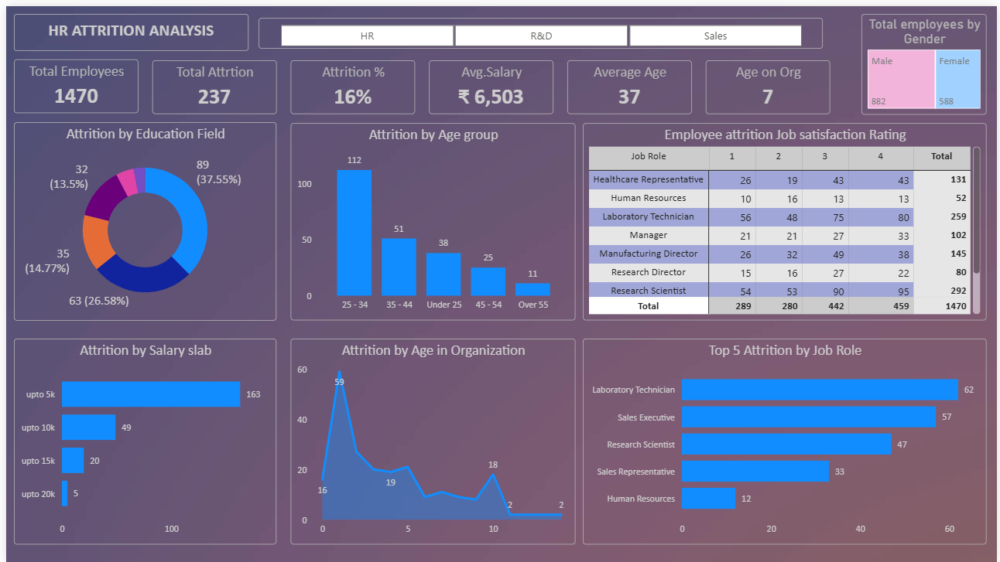

# HR Attrition Analysis | Power BI Dashboard

An interactive Power BI dashboard that analyzes employee attrition to help HR teams understand who is leaving, when, and why.

   

## Project Overview
Employee attrition is costly. This project analyzes a dataset of **1,470 employees** to identify the factors most associated with employees leaving the organization.

## Objectives
- Measure overall attrition and track key HR KPIs
- Identify high-risk age groups, job roles, and salary bands
- Understand the link between tenure, job satisfaction, and attrition

## Key Metrics
| Metric | Value |
|---|---|
| Total Employees | 1,470 |
| Total Attrition | 237 |
| Attrition Rate | 16% |
| Average Age | 37 |
| Average Tenure | 7 years |

## Key Insights
- **Age:** Employees aged 25–34 have the highest attrition (112 cases)
- **Salary:** The lowest salary slab (up to 5k) accounts for 163 of 237 exits
- **Job Role:** Laboratory Technicians (62) and Sales Executives (57) lead attrition
- **Tenure:** Attrition peaks in the first 1–2 years with the company
- **Education:** The largest share of attrition comes from one education field (~37.6%)

## Dashboard Features
- Slicer filters by department (HR, R&D, Sales)
- Attrition by education field, age group, salary slab, and tenure
- Top 5 job roles by attrition
- Job satisfaction rating matrix by role
- Gender distribution card

## Tools Used
- **Power BI Desktop**: data modeling, DAX, visualization
- **Excel/CSV**: source data

## Repository Structure

├── data/        # Raw dataset
├── dashboard/   # Power BI (.pbix) file
├── images/      # Dashboard screenshots
└── README.md

## How to Use
1. Download the `.pbix` file from the `dashboard/` folder
2. Open it in Power BI Desktop
3. Use the department slicer to explore the data

## Recommendations
- Review compensation for entry-level salary bands
- Strengthen onboarding and retention programs in the first two years
- Focus engagement efforts on high-attrition roles

## Author
**Prashanth Udidi**
Data Analytics | Power BI | SQL | Excel | Python
[LinkedIn](https://www.linkedin.com/in/your-profile) • [GitHub](https://github.com/your-username)
